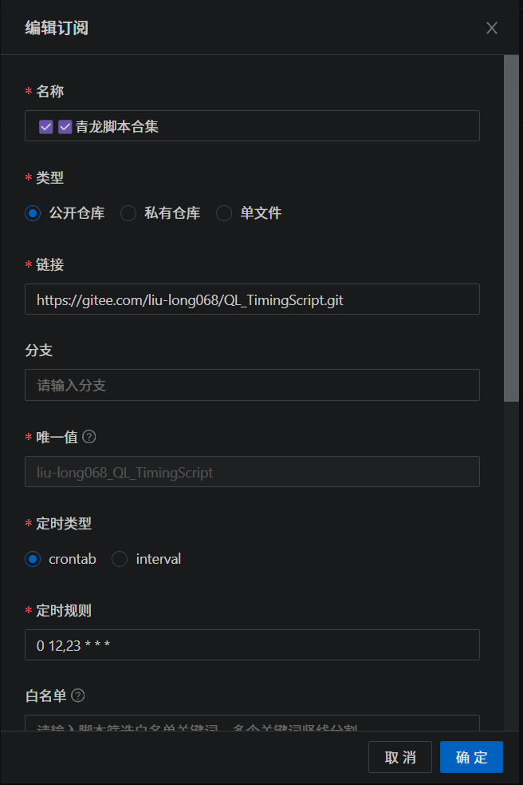
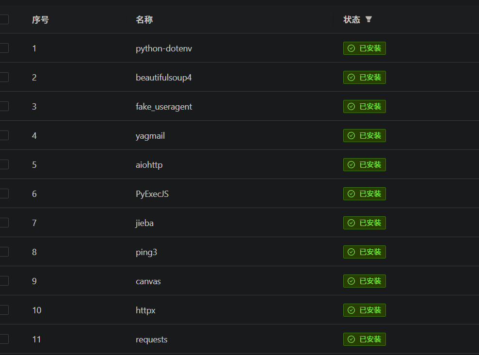
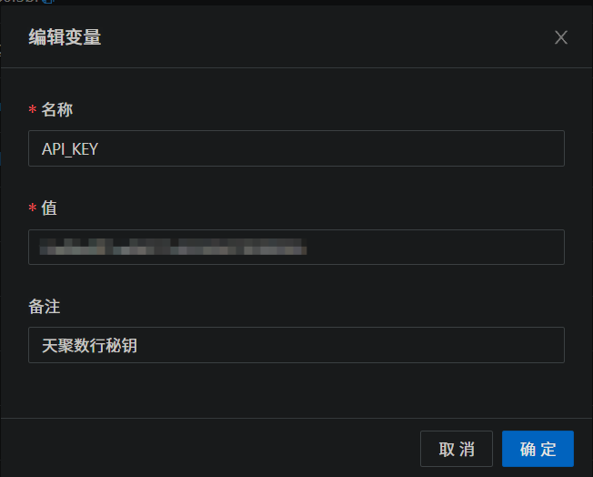

# 工作繁忙，有缘更新！！！

访问量

# 青龙拉取

订阅管理->创建订阅->保存
> 拉取链接：https://gitee.com/liu-long068/QL_TimingScript.git



# 安装依赖

依赖管理->Python3->创建依赖



# 已完成

|                  |                                      | 是否可用 |
|:-----------------|:------------------------------------:|:--------:|
| 微信每日早安推送 | WeChatPublicNumberPushInformation.py |    ✅    |
| 品赞代理         |             pzSignIn.py              |    ✅    |
| 好游快爆         |             好游快爆.py             |    ✅    |
| 哈啰             |           hello_signIn.py            |    ❌    |
| 中国移动云盘（AI豆） |        中国移动云盘.py         |    ✅    |
| 得物森林         |             得物森林.py              |    ✅    |
| 滴滴出行         |             滴滴出行.py              |    ❌    |
| 同程旅行         |               tclx.py                |    ❌    |
| 浓五的酒馆       |            浓五的酒馆.py             |    ❌    |
| 顺丰速运         |               sfsy.py                |    ❌    |
| OPPO商城         |             OPPO商城.py              |    ❌    |
| 安慕希           |              anmusi.py               |    ❌    |

## 中国移动云盘（AI豆）脚本变量

`中国移动云盘.py` 用到的环境变量（脚本开头注释里有完整的「怎么获取」说明）：

| 变量                | 必需 | 说明                                                                     |
|:--------------------|:----:|:-------------------------------------------------------------------------|
| `ydyp_ck`           |  ✅  | `authorization#手机号[#jwtToken][#deviceId]`，多账号用 `@` 分隔           |
| `ydyp_ua`           |  ✅  | 自己手机的 User-Agent（抓包复制整串）。**必需**，不填直接退出              |
| `ydyp_device_id`    | 可选 | 默认设备号；不填按账号派生一个稳定 UUID，各人互不相同                      |
| `ydyp_device_token` | 建议 | 真机设备令牌；**不填则签到/领记录豆被回 614**，抓一次可长期用（见下）       |
| `ydyp_upload_fill`  | 可选 | 是否补足「当月上传满 100 个」，默认 `0`（该通道实测不计入计数）            |

device token 怎么拿（关键）：抓包工具里搜 `receiveV3`（或搜你待领记录的那串数字 ID），
打开那条 POST，复制**请求体里的 `deviceId` 整串**（约 88 字符 base64，形如
`AbCdEf012345...Q==`）填进 `ydyp_device_token`。它由 App 内置 SMSdk 依设备指纹生成、
本机固定，抓一次可长期用；不填的话签到与领记录豆会被服务端判为未知设备，一律回 614。

authorization 怎么拿：手机装 Reqable 抓 App 任意请求的请求头，或用本仓库自带的
「移动云盘抓authorization.zip」（解压后管理员运行，自动抓出）。有效期约 30 天，
接口返回 `05050006 暂无权限！` 即过期，重抓一次替换即可。

配置完先跑只读自检（不签到、不领豆，只打印凭据/豆余额/任务/活动状态）：

```
python 中国移动云盘.py --check
```

## 好游快爆（翻滚吧爆米花）脚本变量

`好游快爆.py` 用到的环境变量（脚本开头注释里有完整的「怎么获取」说明）。玉米庄园每日任务全走纯 HTTP 接口，可青龙定时无人值守；纯接口自动完成签到浇水、收获播种、预约领奖、快爆小游戏、下载游玩、分享、答题（题库命中）、好友互动：

| 变量              | 必需 | 说明                                                                       |
|:------------------|:----:|:---------------------------------------------------------------------------|
| `HYKB_COOKIE`     |  ✅  | 活动登录凭据（抓包请求体里的 `scookie`），多账号用 `@` 分隔                  |
| `HYKB_SMDEVICEID` |  ✅  | 数美设备号（抓包请求体里的 `smdeviceid`）。缺它领取类接口被判风控领不到奖    |
| `HYKB_UA`         |  ✅  | 抓包原样 User-Agent（含机型，服务端做真机白名单校验）。**必需**，不填直接退出；多账号用**换行**分隔（值自带 `@` 不能用 `@` 分隔） |
| `HYKB_DEVICE`     | 可选 | 设备识别码；不填自动取 `HYKB_COOKIE` 第 5 段                                |
| `HYKB_WEB_COOKIE` | 可选 | 网页登录态（`Pauth; Uauth; accesstoken; nickname`），仅预约任务需要，扫码获取 |

抓包怎么拿（前 4 个变量同一次抓包取全）：电脑装 Reqable/Charles/Fiddler 开 HTTPS 解密 →
手机连代理装信任 CA → 打开好游快爆 App 进「翻滚吧爆米花」活动 → **先手动点一次浇水/签到**
（这一步才会发出带 `smdeviceid` 的领取请求）→ 抓包列表按域名 `huodong3.3839.com` 过滤，
打开任意 `ajax_*.php` POST 请求：请求体 `scookie`→`HYKB_COOKIE`、`smdeviceid`→`HYKB_SMDEVICEID`，
请求头 `User-Agent`→`HYKB_UA`。凭据是账号+设备绑定的长期值，抓一次可长期用；
失效表现为脚本报 `loginStatus=103` 或 `blacklist`，重抓一次替换即可。

`HYKB_WEB_COOKIE` 怎么拿（仅预约任务需要，不用抓包）：在能开浏览器的电脑上运行
`python hykb_web_login.tool.py`，浏览器打开 http://127.0.0.1:8899/ ，用快爆 App「扫一扫」
并在手机上确认登录，终端随即打印一整行可直接粘贴的 cookie 串（有效期约 1 年）。
> ⚠️ `hykb_web_login.tool.py` 是本机一次性扫码工具（会常驻 8899 端口），**请勿加入青龙定时任务**。

配置完先跑只读自检（只登录、打印任务清单与风险等级，不执行任何领取）：

```
python 好游快爆.py --probe
```

# 其他

脚本的变量设置，以WeChatPublicNumberPushInformation.py为例：
> 环境变量->创建变量 变量名以脚本内要求为准



# Star History

[](https://www.star-history.com/#NeitherCandiDa/QL_TimingScript&Date)

# 特别声明

本仓库发布的脚本及其中涉及的任何解锁和解密分析脚本，仅用于测试和学习研究，禁止用于商业用途，不能保证其合法性，准确性，完整性和有效性，请根据情况自行判断。

本项目内所有资源文件，禁止任何公众号、自媒体进行任何形式的转载、发布。

本人对任何脚本问题概不负责，包括但不限于由任何脚本错误导致的任何损失或损害。

间接使用脚本的任何用户，包括但不限于建立VPS或在某些行为违反国家/地区法律或相关法规的情况下进行传播, 本人对于由此引起的任何隐私泄漏或其他后果概不负责。

请勿将本仓库的任何内容用于商业或非法目的，否则后果自负。

如果任何单位或个人认为该项目的脚本可能涉嫌侵犯其权利，则应及时通知并提供身份证明，所有权证明，我们将在收到认证文件后删除相关脚本。

任何以任何方式查看此项目的人或直接或间接使用该项目的任何脚本的使用者都应仔细阅读此声明。本人保留随时更改或补充此免责声明的权利。一旦使用并复制了任何相关脚本或Script项目的规则，则视为您已接受此免责声明。

您必须在下载后的24小时内从计算机或手机中完全删除以上内容

您使用或者复制了本仓库且本人制作的任何脚本，则视为 已接受 此声明，请仔细阅读
